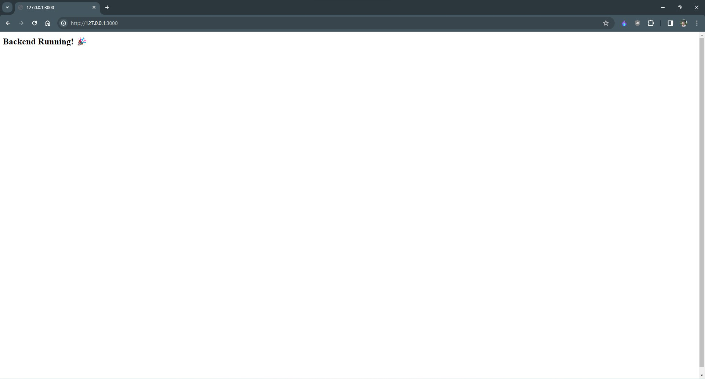

# Social App 

<!-- Node.js Vulnerability Check -->
<!-- CodeQL --> 
</a>

**v1.0.3**

The Social App is built using the following backend development tools:

- bcrypt
- body-parser
- dotenv
- express
- jsonwebtoken
- mongoose
- node-rest-client
- path
- moment-timezone
- prettier
- helmet
- express-rate-limit

## APIs Available

The Social App provides the following APIs:

1. **[POST]** - Signup - `http://{URL}/api/v1/auth/signup`
2. **[POST]** - Signin - `http://{URL}/api/v1/auth/signin`
3. **[POST]** - Add one Post/many Posts (one Post at a time) - `http://{URL}/api/v1/addPost`
4. **[GET]** - Fetch all Posts specifying user - `http://{URL}/api/v1/posts`
5. **[DELETE]** - Delete one Post specifying Post Id - `http://{URL}/api/v1/posts`
6. **[DELETE]** - Delete All Post specifying userId - `http://{URL}/api/v1/allposts`

Note: Replace `{URL}` with your actual URL.

### Installation:-

- Run this command to install dependencies

  ### `npm install`

  **NOTE:** If above command doesn't install all dependencies, run below command

  ### `npm run build`

- Start the server by running this command
  ### `npm run start`
- To check if all is working good! 🎉 - http://{URL}:{SERVER_PORT}
- **N.B.** - **SERVER_PORT** can be defined in **".env"** file, otherwise it will default to **3001**

 

<!--  -->

### Note to Developers:-

- I have added my MongoDB database URL to my Environment Variable **(.env)** file and all other secrets, so I insist to create a **(.env)** file and add necessary configuration data which is needed to be hidden from end-user/other developers.

- All the API's mentioned above will work best in Postman (Preferred, becoz I use it!) for testing and development, but other apps may also be used.

### Update

**_30-05-2023_**

- Testing Backend API's and other features to optimise it. Need a Front-end part to be build.

**_01-06-2023_**

- Added some functionalities.

**_27-09-2023_**

- Added some functionalities.
- Updated README

**_12-01-2024_**

- Added helmet for secured headers
- Added api rate limit for security
- Added CodeQl, Node.js Vulnerability Check for security
- Implemented Prettier for uniform code formatting and readability throughout the project
